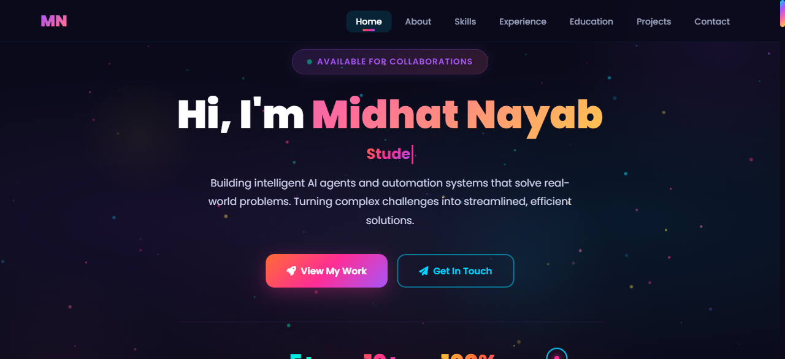

# Midhat Nayab — AI Developer Portfolio

A sleek, neon-themed personal portfolio showcasing AI development projects, skills, and achievements.

[](https://midhat-nayab-portfolio.vercel.app)

## Preview



## Features

- Vibrant neon dark theme with rainbow gradients
- Glass-morphism navigation bar with blur effect
- Custom animated cursor (dot + ring)
- Smooth scroll with section-based layout
- Fully responsive design for all devices
- Animated typing effect on hero section
- Skill progress bars with animations
- Interactive project cards
- Contact form with social links
- 7 sections: Hero, About, Skills, Experience, Education, Projects, Contact

## Tech Stack

| Technology | Usage |
|------------|-------|
| HTML / CSS / JS | Single-file build in `index.html` |
| Google Fonts | Poppins (body) + Fira Code (code accents) |
| FontAwesome 6.5 | Icons throughout |
| Vercel | Hosting & auto-deploy from GitHub |

## Project Structure

```
midhat-portfolio/
├── index.html                # Full site (HTML + CSS + JS)
├── midhat-portfolio-live.png # Preview screenshot
└── README.md                 # This file
```

## Getting Started

Just open `index.html` in your browser — no build tools needed.

```bash
git clone https://github.com/midhatnayab7-creator/midhat-portfolio.git
cd midhat-portfolio
open index.html
```

## Author

**Midhat Nayab** — AI Developer & Student Innovator

[](mailto:midhatnayab7@gmail.com)
